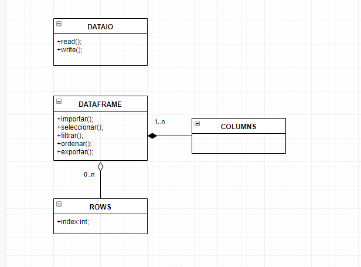
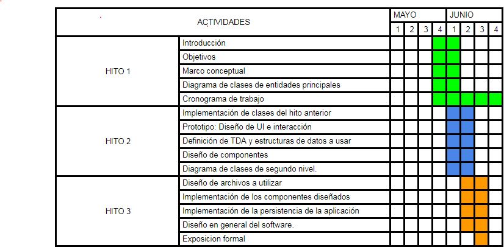

Algoritmos y Estructuras de Datos
=================================

Trabajo Final
-------------

Equipo de trabajo:
- Sebastian Garcia
- Jose Hervacio

Introduccion
-------------
Motivacion: Realizaremos este proyecto con el objetivo de crear una solucion a la atención de necesidades teniendo en cuenta restricciones económicas, sociales, políticas, éticas, de salud y seguridad y otras propias del entorno empresarial mediante un programa el cual nosotros diseñaremos y crearemos.

Problematica: Muchas veces tenemos millones de registros y no podemos manejar estas grandes cantidades de datos, ya sea porque el sistema que se hizo no es el adecuado o por una mala implementacion por parte de los usuarios.

Solucion: Implementar una estructura DataFrame basada en una estructura data frame de phyton.

Objetivos
----------
Nuestro objetivo propuesto es crear un programa usando todo lo aprendido durante el presente ciclo academico como los ordenamientos, busqueda binaria, listas, entre otros y a la vez haremos que este sea mas facil de usar por parte del usuario, con una interfaz sencilla y facil de comprender.

Marco conceptual
-----------------
-DataFrame: Es una estuctura de datos compuesta por filas y columnas similar a una matriz que nos permite manipular una cantidad de datos muy grande. 

-Arbol: Un árbol es una estructura no lineal en la que cada nodo puede apuntar a uno o varios nodos.

Diagrama de Clases
------------------

Cronograma del Trabajo Final
----------------------------

