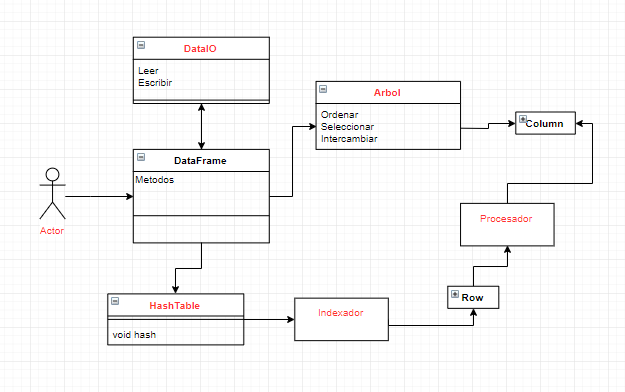
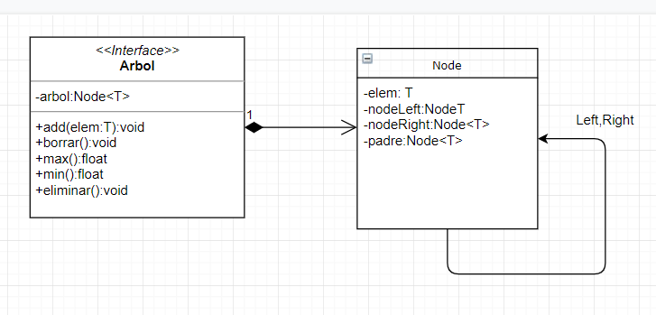
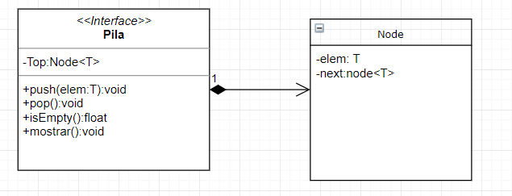

Algoritmos y Estructuras de Datos
=================================

Trabajo Final
-------------

Equipo de trabajo:
- Sebastian Garcia
- Jose Hervacio

Introduccion
-------------
Motivacion: Realizaremos este proyecto con el objetivo de crear una solucion a la atención de necesidades teniendo en cuenta restricciones económicas, sociales, políticas, éticas, de salud y seguridad y otras propias del entorno empresarial mediante un programa en el lenguaje c++ el cual nosotros diseñaremos y crearemos.

Problematica: Muchas veces tenemos millones de registros y no podemos manejar estas grandes cantidades de datos, ya sea porque el sistema que se hizo no es el adecuado o por una mala implementacion por parte de los usuarios.

Solucion: Implementar una estructura DataFrame basada en la libreria de phyton (pandas).

Objetivos
----------
Nuestro objetivo propuesto es crear un programa usando todo lo aprendido durante el presente ciclo academico como los ordenamientos, busqueda binaria, listas, entre otros y a la vez haremos que este sea facil de usar por parte del usuario, con una interfaz sencilla y facil de comprender, ademas de que el tiempo en que se demore en buscar los elementos dados sea el minimo posible.

Marco conceptual
-----------------
- DataFrame: Es una estuctura de datos compuesta por filas y columnas similar a una matriz que nos permite manipular una cantidad de datos muy grande. 

- Arbol:En ciencias de la computación y en informática, un árbol es un tipo abstracto de datos (TAD) ampliamente usado que imita la estructura jerárquica de un árbol, con un valor en la raíz y subárboles con un nodo padre, representado como un conjunto de nodos enlazados. Una estructura de datos de árbol se puede definir de forma recursiva (localmente) como una colección de nodos (a partir de un nodo raíz), donde cada nodo es una estructura de datos con un valor, junto con una lista de referencias a los nodos (los hijos) , con la condición de que ninguna referencia esté duplicada ni que ningún nodo apunte a la raíz. Alternativamente, un árbol se puede definir de manera abstracta en su conjunto como un árbol ordenado, con un valor asignado a cada nodo. Ambas perspectivas son útiles: mientras que un árbol puede ser analizado matemáticamente, realmente es representado como una estructura de datos en la que se trabaja con cada nodo por separado (en lugar de como una lista de nodos y una lista de adyacencia entre nodos, como un grafo). Mirando a un árbol como conjunto, se puede hablar de el nodo padre de un nodo dado, pero en general se habla de una estructura de datos de un nodo dado que sólo contiene la lista de sus hijos sin referencia a su padre (si lo hay).

- Programacion orientada de objetos(POO): Es un paradigma de programación que viene a innovar la forma de obtener resultados. Los objetos manipulan los datos de entrada para la obtención de datos de salida específicos, donde cada objeto ofrece una funcionalidad especial.

Diagrama de Clases
------------------

Cronograma del Trabajo Final
----------------------------

Diagrama de Clases de Bajo Nivel
----------------------------

Diseño de TDA
-------------
Utilizaremos los siguientes tipos de datos abstractos:

-Arbol Binario

-Pila

-HashTable

-Lista

Arbol
-----

Pila
----

Conclusiones:
----------------
De este trabajo se puede concluir que gracias a la utilización de estructura de datos Avanzados como los Arboles Binarios y algoritmos de búsqueda, se pueden obtener resultados óptimos si acotas la situación hacia un objetivo especifico, puesto que no todos los algoritmos son el mas apropiado para ciertas tareas especificas

Refeencias:
---------------
- Aula virtual: material de clase
- https://www.geeksforgeeks.org/
